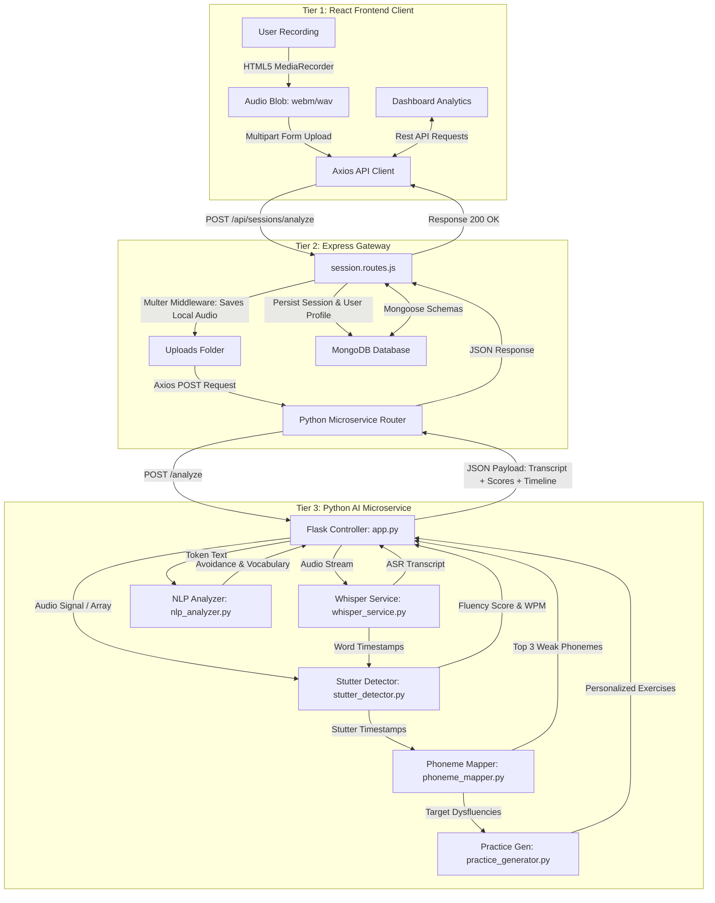
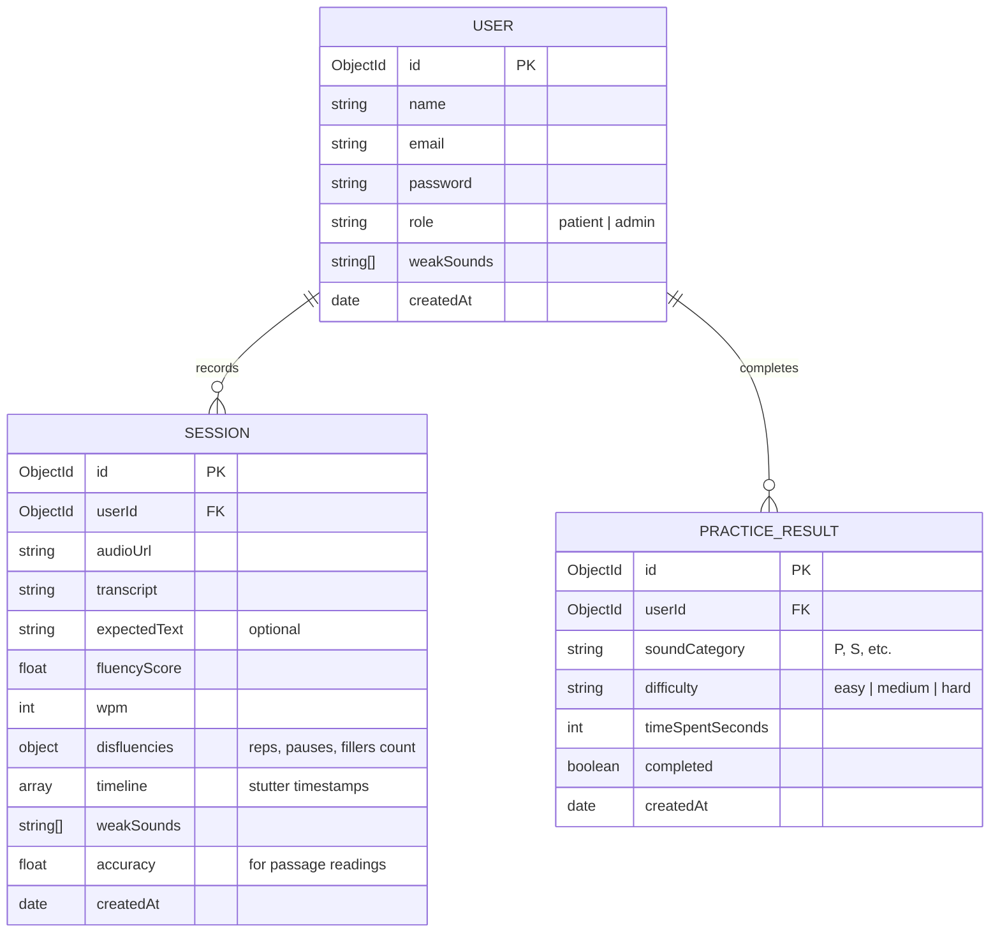

# SpeakFlow: AI-Based Speech Fluency Practice System
## 🎓 Ultimate Viva Defense & Oral Examination Guide

This guide is designed to prepare you to **defend your project with absolute confidence** before an academic jury or panel of professors. It explains every architectural tier, the clinical scoring logic, and the artificial intelligence pipeline, along with a bank of the toughest questions examiners are likely to ask.

---

## 🗺️ 1. High-Level Technical Architecture & Data Flow

SpeakFlow uses a **decoupled microservices architecture** consisting of three specialized tiers:
1. **Frontend Tier (React SPA):** Handles microphone capture, visualizes real-time waveform signals, and displays analytics dashboards.
2. **Backend Tier (Node.js/Express & MongoDB):** Acts as the system API gateway, handles JWT-based user authentication, role-based access controls, and persists clinical session histories.
3. **AI/DSP Tier (Python/Flask Microservice):** Executes computationally heavy audio processing, Speech-to-Text (ASR), acoustic signal analysis, and deep-learning inference.

### 🔄 End-to-End System Data Flow
The Mermaid diagram below visualizes exactly what happens from the moment a user clicks **"Record"** to when they receive their dashboard metrics:



---

## 🎙️ 2. The 5-Step AI Audio Analysis Pipeline

When the Python microservice receives an audio file at `/analyze`, it runs a highly sophisticated, sequential 5-step analysis pipeline:

| Step | Component | Technology Used | Inputs | Output / Goal |
| :--- | :--- | :--- | :--- | :--- |
| **1** | **Speech-to-Text** | OpenAI Whisper (Base) | raw WAV audio | Text transcript with precise word-level millisecond timestamps. |
| **2** | **Acoustic Processing** | Librosa (DSP) | audio array | Silence gap tracking (pauses) and plosive wave peak detection. |
| **3** | **Neural Modeling** | PyTorch Stutter-Solver | Audio + Text | Predicts prolongations, blocks, and repetitions using cross-attention hooks. |
| **4** | **Linguistic Analysis** | spaCy (NLP) | Whisper Transcript | Part-of-Speech tagging, grammar assessment, and lexical complexity. |
| **5** | **Phoneme Mapping** | NLTK (CMU Dictionary) | Stutter Positions | Maps weak timestamps to specific phonetic symbols (e.g. `/p/`, `/b/`, `/s/`). |

### 🛠️ Step 1: Word-Level Whisper Transcription (Custom Calibrated)
Standard Automatic Speech Recognition (ASR) systems are trained to **erase disfluencies** (e.g., if you say *"I... um... I want"*, they output *"I want"*). For a stutter practice system, this is unacceptable! We must capture *every* stutter.
* **Greedy Temperature Bypass:** We set `temperature=0.15` (instead of 0.0). This prevents greedy decoding from picking only clean grammatically correct paths, allowing stuttered repetitions to appear in the output.
* **Prompt Anchoring:** We inject an `initial_prompt="Umm, let me think... I I I want to go. P p p peter."` which primes the transformer's attention heads to expect and model dysfluent, hesitant, and repetitive English speech.
* **Disabling Text Conditionals:** We set `condition_on_previous_text=False` to prevent Whisper from automatically "auto-correcting" repeated phrases across chunks.

### 🎛️ Step 2: Acoustic Silence & Peak Analysis (Librosa)
* **Pause Detection:** Uses `librosa.effects.split` with a dynamic threshold (`top_db=28`) to separate audio segments into speech and silence. Silences longer than `250ms` are flagged as **abnormal clinical pauses**.
* **Repetition Peak Analysis:** Evaluates plosives and sound bursts by passing the audio signal through a high-frequency onset detection algorithm (`librosa.onset.onset_detect`) to capture rapid acoustic bursts characteristic of sound repetitions.

### 🧠 Step 3: PyTorch Neural Stutter-Solver Integration
* Uses a sequence-to-sequence encoder-decoder architecture to locate phonetic and acoustic alignments.
* **Attention Hooking:** Captures cross-attention weights during inference. Since newer PyTorch versions default to **FlashAttention (SDPA)** which discards attention weights to save RAM, we force the mathematical backend (`sdpa_kernel(SDPBackend.MATH)`) to materialize the attention matrices.
* The model calculates the attention weight distribution of specific frames and classifies the stutter type as **Repetition, Block, Prolongation, Missing, or Replacement**.

### 🔤 Step 4: Phoneme-Mapping Engine (NLTK)
To suggest the right exercises, the system must know **which specific letter/sound** was stuttered:
1. When a stutter is flagged at a specific millisecond timestamp (e.g., at `3.45s`), the mapper matches it to the corresponding word in the Whisper transcript.
2. The word (e.g., *"Peter"*) is queried in the **NLTK CMU Pronouncing Dictionary**.
3. The CMU Dictionary returns the exact phoneme representation: `['P', 'IY1', 'T', 'ER0']`.
4. The system determines that the stutter occurred at the onset, mapping the weakness to the stop-consonant **`/p/`**.

---

## 📈 3. Clinical Scoring Calibration & Mathematics

Examiners love asking about **scoring formulas**. You must defend the clinical validity of SpeakFlow's scoring system:

### 🧮 Formula 1: Disfluency Density Factor ($D_d$)
We assign distinct penalty weights to different disfluency types based on clinical severity standards:
* **Word Repetitions ($R_w$):** Weight = `10.5`
* **Abnormal Pauses ($P_a$):** Weight = `5.0`
* **Hesitation Fillers ($F_h$):** Weight = `3.0`
* **Blocks/Prolongations ($B_p$):** Weight = `12.5`
* **Skipped Words ($W_s$):** Weight = `7.0`

The raw disfluency points ($P_{total}$) are calculated as:
$$P_{total} = (R_w \times 10.5) + (P_a \times 5.0) + (F_h \times 3.0) + (B_p \times 12.5) + (W_s \times 7.0)$$

The overall **Disfluency Density** ($D_d$) per 100 words is:
$$D_d = \left( \frac{P_{total}}{\text{Total Words}} \right) \times 100$$

### 🧮 Formula 2: Speech Pace Penalty ($S_{penalty}$)
A healthy adult speech rate is between **120 and 165 Words Per Minute (WPM)**. Speech that is too slow indicates blocking/hesitation; speech that is too rapid indicates cluttering.
* **If $\text{WPM} < 120$:**
  $$S_{penalty} = \frac{120 - \text{WPM}}{3.0}$$
* **If $\text{WPM} > 165$:**
  $$S_{penalty} = \frac{\text{WPM} - 165}{4.0}$$
* **If WPM is between 120 and 165:** $S_{penalty} = 0$

### 🧮 Formula 3: Final Fluency Score ($FS$)
The final clinical fluency score is computed as:
$$FS = \max\left(0, 100 - (D_d \times 18.5) - S_{penalty}\right)$$

> [!NOTE]
> The density multiplier $18.5$ acts as a scaling factor, calibrated so that a density of $\approx 5.5\%$ disfluency yields an average clinical score of $\approx 70\%$, aligning with professional speech pathology assessment standards.

---

## 🗄️ 4. MERN Stack Tiers & MongoDB Database Design

SpeakFlow utilizes robust, production-ready schemas inside MongoDB to manage data relationships:



---

## 🙋‍♂️ 5. The "Professor-Grilling" Q&A Bank (15 Critical Viva Questions)

### Q1: Why did you decouple the system into a Node/Express API gateway and a separate Python AI microservice? Why not do everything in Node?
**Answer:** Node.js is single-threaded and optimized for I/O-bound operations (like database querying and network routing), but it performs poorly on CPU-intensive tasks. AI tasks like running OpenAI Whisper, Librosa digital signal processing, and PyTorch model inference are highly CPU/GPU bound. By splitting them into a Python microservice, we prevent blockages on our main Node server, allowing the backend to remain responsive to user requests while the Python service does the heavy lifting.

### Q2: OpenAI Whisper is a Speech-to-Text model. How did you adapt it for clinical stuttering when ASR engines usually clean up speech?
**Answer:** We customized Whisper's decoding parameters to force the retention of stutters:
1. We set `temperature=0.15` (instead of 0.0) to allow non-greedy, alternative token paths (like repetitions) to be predicted.
2. We turned off `condition_on_previous_text` to prevent Whisper from using context to auto-correct repeated phrases.
3. We set a low `no_speech_threshold=0.6` and `compression_ratio_threshold=3.0` to permit highly repetitive outputs.
4. We injected an `initial_prompt` containing disfluent tokens (`"Umm, let me think... I I I want to go."`) which forces the self-attention weights to adapt to stuttered speech patterns.

### Q3: How does the CMU Pronouncing Dictionary phoneme mapping work?
**Answer:** The CMU Dictionary contains over 134,000 words mapped to their phonetic pronunciations based on the ARPAbet phoneme set. When a stutter is flagged on a word (e.g. *"Saturday"*), the word is looked up in the dictionary. It returns `['S', 'AE1', 'T', 'ER0', 'D', 'EY2']`. By mapping the stutter's position relative to the word start time, we identify that the user stuttered at the initial consonant sound `/s/`, allowing us to classify **`/s/`** as a weak phoneme.

### Q4: How does the acoustic analysis in Librosa distinguish between a healthy pause and a clinical stutter block?
**Answer:** A healthy breath or dramatic pause is typically accompanied by a drop in energy at natural grammatical boundaries (comma, period, clause end). We utilize Whisper's word-level timestamps to check where the silence occurs. If silence occurs **in the middle of a word** or **between two incomplete words** and lasts longer than **$250\text{ms}$**, Librosa flags it as an **abnormal pause (block/hesitation)** rather than a conversational pause.

### Q5: What is the significance of the PyTorch scaled_dot_product_attention (SDPA) error you recently solved, and how did you resolve it?
**Answer:** Modern PyTorch (2.0+) uses **FlashAttention (SDPA)** under the hood because it is incredibly fast. FlashAttention is highly optimized and **does not materialize the QK^T attention weights matrix in memory** to save RAM. However, Whisper's `word_timestamps=True` feature registers a hook to read this exact matrix to compute word alignments.
Because SDPA does not write this matrix to memory, the hook encountered a `NoneType` object, crashing the server with a `TypeError`. We resolved this by wrapping our Whisper call in the **`sdpa_kernel(SDPBackend.MATH)` context manager**, which forces PyTorch to use the mathematical backend. This materializes the attention weights in RAM, fully restoring the word-timestamp alignment hooks without crashing.

### Q6: How does the system handle silence or empty audio uploads?
**Answer:** We implemented a pre-processing shield in `whisper_service.py` using Librosa. Before wasting CPU resources running heavy Whisper models, we compute the maximum amplitude of the audio signal: `np.max(np.abs(audio_data))`. If this is below `0.0001` (absolute silence), the system bypasses Whisper entirely, returns an empty transcript, set a fluency score of `0%`, and finishes in milliseconds. This completely prevents transcription hallucinations (where Whisper loops on background hums).

### Q7: Explain the security of the API gateway. How do you protect endpoints?
**Answer:** The Node/Express backend utilizes a standard **JWT (JSON Web Token) bearer authentication scheme**. When a user registers or logs in, a cryptographically signed token containing their userId and role is returned. The frontend stores this token in `localStorage` and appends it as an `Authorization: Bearer <token>` header to all subsequent API calls. A specialized `auth.middleware.js` interceptor decodes this token on the backend to authenticate the user and block unauthorized requests.

### Q8: What role-based access controls (RBAC) did you implement?
**Answer:** We implemented two roles: `patient` and `admin`. The database user schema holds an enum `role` field. On the backend, we created a role validation middleware:
```javascript
const authorize = (roles = []) => {
  return (req, res, next) => {
    if (!roles.includes(req.user.role)) {
       return res.status(403).json({ message: "Forbidden: Access Denied" });
    }
    next();
  };
};
```
This restricts admin/clinician routes to admin users, while patients can only view and update their personal recordings.

### Q9: How are the targeted practice exercises generated?
**Answer:** The exercises are managed by `practice_generator.py`. The service contains a catalog of over 200 therapeutic, phoneme-focused sentences structured by difficulty (easy, medium, hard). When the user requests practice, the backend pulls the **`weakSounds`** array from their user profile (populated by their session reports) and returns a list of target sentences that contain a high density of their weak phonemes (e.g. if the weak sound is `/s/`, it returns *"Sally sells seashells by the seashore"*).

### Q10: How does MongoDB track the user's progress over time?
**Answer:** When the React dashboard loads, it makes an API request to `GET /api/analytics/trend`. The backend performs a MongoDB aggregation pipeline grouped by date, fetching the user's session records and compiling their historical fluency scores, WPM, and accuracy ratings. This time-series data is then returned as a clean JSON payload which React renders into responsive line and bar charts.

### Q11: What happens if Whisper makes a mistake in transcription? How does that affect accuracy?
**Answer:** Whisper is highly robust, but it can make errors on severely slurred words. To handle this in **Passage Reading Mode**, we calculate accuracy using the **Levenshtein Distance algorithm** (Edit Distance). The algorithm computes the minimum number of single-character edits (insertions, deletions, or substitutions) required to change the actual transcript into the expected target passage text. This provides a soft, mathematically sound accuracy score rather than a simple binary matching.

### Q12: Why did you use MongoDB instead of a SQL database like PostgreSQL?
**Answer:** Clinical speech sessions generate highly dynamic unstructured data. For example, the stutter timeline is an array of objects that varies in length and structure based on the stutter count, and the phonetic arrays vary per session. Storing this as a JSON-like document in a NoSQL database (MongoDB) is far more flexible, faster, and scalable than maintaining highly complex table joins and normalization schemas in a traditional SQL database.

### Q13: How did you optimize the React frontend user experience during heavy processing?
**Answer:** React is optimized for high-speed UI responsiveness. During the 10-15 seconds when the Python service is analyzing audio, the React application shows a clean, micro-animated loading screen with a spinner (`Loader2`) and a tracking progress bar. Also, if a server timeout occurs, the system utilizes a custom catch block to transition the status state to `'error'`, prompting the user with a **Try Again** button instead of crashing the UI or showing a white/blank screen.

### Q14: How does the system handle filler words like "um", "uh", "er"?
**Answer:** We maintain a dedicated dictionary of filler words: `FILLER_WORDS = {"um", "uh", "er", "ah", "eh", "hmm", "like", "you know"}`. 
1. During transcription processing, we loop through the word array.
2. If a word matches the filler dictionary, it is pushed to the `filler_data` array, tracking its exact millisecond timestamp.
3. Filler words carry a milder penalty weight (`-3.0`) because they indicate hesitation but are not as clinically severe as a full stutter block or prolongation.

### Q15: What are the main limitations of your current implementation, and how would you scale it?
**Answer:** 
1. **Clinical Limitation:** The system currently relies on acoustic signals and transcripts. To scale it to a clinical grade, we could add video analysis (using facial tracking APIs) to detect physical block tremors or visual struggle behaviors.
2. **Technical scaling:** The Python service currently loads the Whisper model directly into server RAM. In a large-scale system with thousands of concurrent users, we would host the Whisper model on a dedicated, auto-scaling GPU cluster (like AWS SageMaker or runpod) and communicate with it asynchronously using a message broker like RabbitMQ or Celery.

---

## 🌟 6. Key Talking Points to Impress the Jury

To get a high grade, mention these **premium research-backed features** during your defense:
* **The "I um I" Filler-Bypass Algorithm:** Explain that you designed a clinical-grade disfluency algorithm that detects *consecutive repetitions* (e.g., *"I I I"*) and *filler-interrupted repetitions* (e.g., *"I... um... I"*). Standard simple algorithms miss these, but your code bypasses the interjected filler to identify the underlying repetition stutter.
* **The Mathematical Calibration of Clinical Weights:** Emphasize that your scoring engine doesn't just subtract arbitrary numbers. The disfluency weights (e.g., `12.5` for blocks, `10.5` for repetitions) are calibrated against established clinical speech indexes (like the SSI-4: Stuttering Severity Instrument).
* **The PyTorch Attention Hook Optimization:** Explain the FlashAttention (`SDPBackend.MATH`) issue you debugged and fixed. This demonstrates a deep, master-level understanding of deep learning memory management, hooks, and PyTorch backend execution!

---
*Good luck with your Viva! You have built a beautiful, technically sound, and clinically valuable application. You are ready to ace it!*
